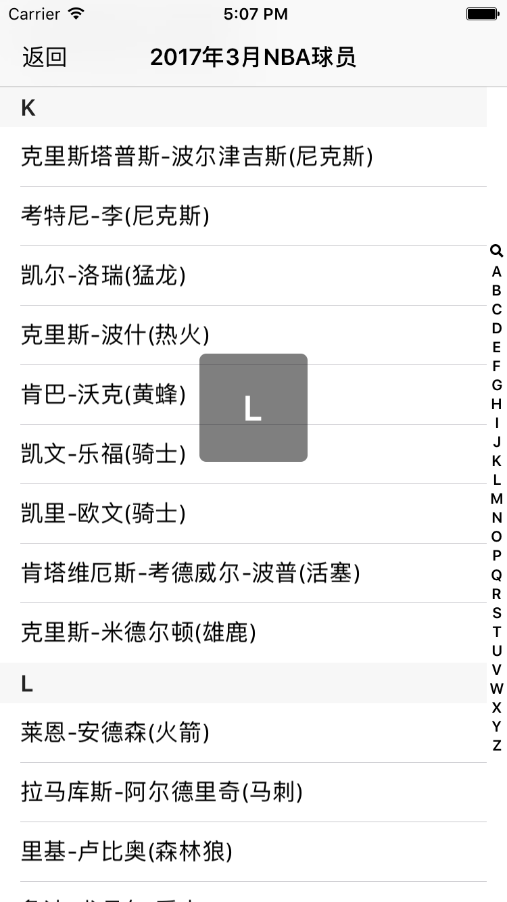
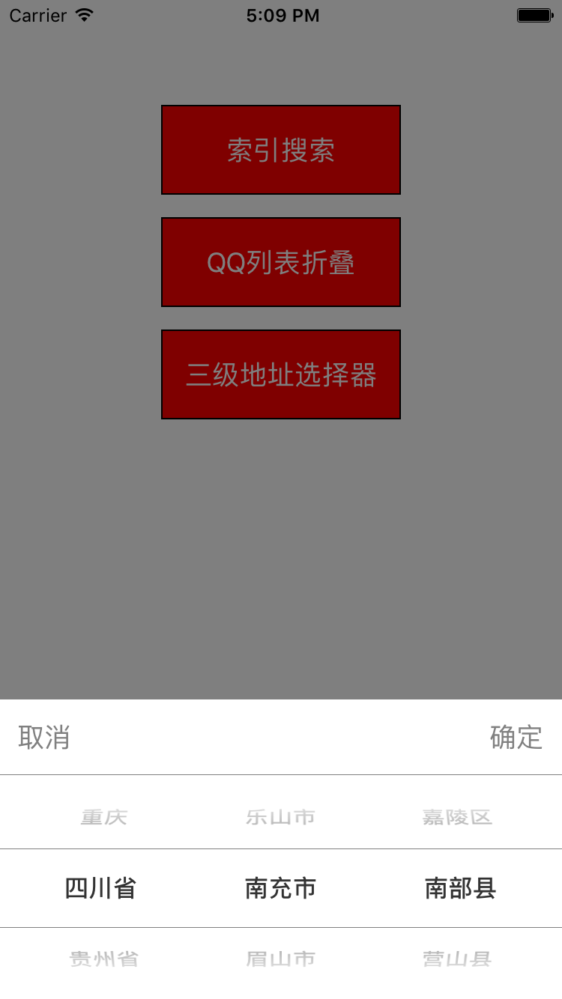

# FoldAndSearch
# 索引搜索 二级折叠 三级地址选择   

## 1、根据首字母搜索列表
###### 1）、数据有点多 点击后请耐心等待
kindDic = [[NSMutableDictionary alloc]initWithCapacity:0];
for (char i = 'A'; i <= 'Z'; i ++)
{
       NSMutableArray * arr = [[NSMutableArray alloc]init];
       [kindDic setObject:arr forKey:[NSString stringWithFormat:@"%c",i]];
   }
    
###### 2）、根据数据进行分组
 for (char i = 'A'; i <= 'Z'; i ++)
{
       NSMutableArray * arra = [kindDic objectForKey:[NSString stringWithFormat:@"%c",i]];
       [arra removeAllObjects];
}
    
for (int j = 0; j < arr.count; j ++)
{
       NSString * ziMuStr = [self firstCharactor:arr[j]];
       for (char i = 'A'; i <= 'Z'; i++)
       {
       NSString *ziM = [NSString stringWithFormat:@"%c",i];
       if ([ziM isEqualToString:ziMuStr])
            {
                NSMutableArray * arrar = [kindDic objectForKey:[NSString stringWithFormat:@"%c",i]];
                [arrar addObject:arr[j]];
            }
        }
 } 
######  

## 2、类似于QQ列表折叠
###### 自定义XDMultTableView类 所有代理方法跟UITableView一致
section的数量
- (NSInteger)numberOfSectionsInTableView:(XDMultTableView *)mTableView;

## 3、三级地址联动
###### 从服务端获取数据
// 地区类型 areaType   父类编号 parentAreaNo
- (void)getPickerData:(NSString*)areaType parentAreaNo:(NSString*)parentAreaNo

